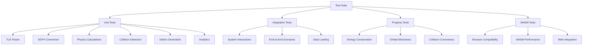

# Comprehensive Testing Strategy for Kessler Syndrome Simulator

## Overview

This plan establishes a complete testing framework for the web-based Kessler Syndrome Simulator, ensuring scientific accuracy, performance validation, and reliability across all systems. The testing strategy covers unit tests, integration tests, property-based tests, and WASM-specific browser tests.

## Testing Architecture




## Implementation Plan

### Phase 1: Test Infrastructure Setup

**Files to Create:**

- `tests/common/mod.rs` - Shared test utilities and fixtures
- `tests/fixtures/` - Test data (TLE samples, known orbital scenarios)
- `Cargo.toml` - Add test dependencies

**Dependencies to Add:**

```toml
[dev-dependencies]
proptest = "1.4"              # Property-based testing
wasm-bindgen-test = "0.3"     # WASM testing
approx = "0.5"                # Floating-point comparisons
criterion = "0.5"             # Benchmarking
mockall = "0.12"              # Mocking (if needed)
```

**Test Utilities:**

- `create_test_tle()` - Generate test TLE records
- `create_test_orbital_state()` - Create known orbital states
- `assert_energy_conserved()` - Energy conservation assertions
- `assert_orbital_valid()` - Orbital mechanics validation

### Phase 2: Unit Tests

#### 2.1 TLE Parser Tests (`tests/tle_parser_test.rs`)

**Test Cases:**

- Valid TLE parsing (all fields correct)
- Edge cases: missing fields, malformed lines, invalid formats
- Exponential notation parsing (`12345-3` format)
- Decimal fraction parsing
- Multiple TLE records in one file
- Error handling for invalid data

**Key Functions to Test:**

- `parse_tle_data()` - Main parser
- `TleRecord::from_tle_lines()` - Record creation
- `parse_exponential()` - Exponential notation
- `parse_decimal_fraction()` - Decimal parsing

**Test Fixtures:**

- Real TLE samples from `assets/tles/`
- Malformed TLE edge cases
- Boundary value tests (min/max field values)

#### 2.2 SGP4 Conversion Tests (`tests/sgp4_wrapper_test.rs`)

**Test Cases:**

- TLE to state vector conversion accuracy
- Kepler's equation solver convergence
- Coordinate system transformations (orbital → ECI)
- Epoch propagation correctness
- Known satellite positions (ISS, Hubble) vs real data
- Edge cases: high eccentricity, low altitude

**Key Functions to Test:**

- `tle_to_state_vectors()` - Main conversion
- `solve_keplers_equation()` - Numerical solver
- `propagate_to_current_time()` - Time advancement
- `days_since_epoch()` - Epoch calculations

**Validation:**

- Compare against known satellite positions from NORAD
- Verify orbital period calculations
- Check energy conservation in conversions

#### 2.3 Physics System Tests (`tests/physics_test.rs`)

**Test Cases:**

- Gravitational force calculations
- Orbital velocity for circular orbits
- Energy calculations (kinetic, potential, total)
- Euler integration accuracy
- Energy conservation over time
- Orbital period preservation

**Key Functions to Test:**

- `physics_system()` - Main physics update
- `OrbitalState::kinetic_energy()`
- `OrbitalState::potential_energy()`
- `OrbitalState::total_energy()`
- `Constants::circular_velocity()`

**Property Tests:**

- Energy should be conserved (within numerical precision)
- Orbital period should remain constant
- Angular momentum should be conserved

#### 2.4 Collision Detection Tests (`tests/collision_test.rs`)

**Test Cases:**

- Octree insertion and querying
- Sphere-sphere collision detection
- Spatial partitioning correctness
- Collision pair deduplication
- Edge cases: overlapping objects, boundary conditions

**Key Functions to Test:**

- `OctreeNode::insert()` - Octree insertion
- `OctreeNode::query_sphere()` - Spatial queries
- `collision_detection_system()` - Main collision system
- `sphere_intersects_cube()` - Intersection testing

**Test Scenarios:**

- Known collision scenarios (two objects at same position)
- Non-collision scenarios (distant objects)
- Boundary cases (objects at octree boundaries)

#### 2.5 Debris Generation Tests (`tests/debris_test.rs`)

**Test Cases:**

- NASA breakup model debris count
- Mass conservation in debris generation
- Debris velocity distribution
- Multi-generation debris tracking
- Energy transfer from collision to debris

**Key Functions to Test:**

- `debris_generation_system()` - Main debris creation
- Debris count calculation based on collision energy
- Mass distribution across debris fragments
- Velocity vector generation

**Validation:**

- Total mass before/after collision should be conserved
- Debris count should match NASA model predictions
- Debris velocities should be physically reasonable

#### 2.6 Analytics Tests (`tests/analytics_test.rs`)

**Test Cases:**

- Energy binning by altitude
- Statistics calculations (averages, totals)
- Altitude bin assignment
- Energy measurement aggregation

**Key Functions to Test:**

- `EnergyAnalytics::add_energy_measurement()`
- `EnergyAnalytics::get_altitude_bin()`
- `EnergyAnalytics::get_average_energy()`
- `energy_analytics_system()`

### Phase 3: Integration Tests

#### 3.1 System Integration Tests (`tests/integration_test.rs`)

**Test Scenarios:**

- Full simulation cycle: load TLE → spawn satellites → run physics → detect collisions
- Collision cascade: collision → debris generation → subsequent collisions
- Data loading integration: TLE parsing → SGP4 conversion → entity spawning
- Physics + collision: objects move → collisions detected → debris created

**Test Cases:**

- End-to-end simulation with known initial conditions
- Multi-step physics updates with collision detection
- Debris mechanics integration (injection + decay)
- Analytics collection during simulation

#### 3.2 Data Loading Integration (`tests/data_integration_test.rs`)

**Test Scenarios:**

- Embedded TLE data loading (WASM path)
- TLE parsing → satellite spawning → physics initialization
- Test dataset fallback when real data unavailable
- Multiple TLE records processed correctly

### Phase 4: Property-Based Tests

#### 4.1 Energy Conservation Tests (`tests/property_energy_test.rs`)

**Properties to Verify:**

- Total energy should be conserved (within numerical precision) over time
- Energy should scale correctly with mass and velocity
- Potential energy should decrease as altitude increases
- Kinetic energy should increase with velocity magnitude

**Using Proptest:**

- Generate random orbital states
- Run physics updates
- Verify energy conservation

#### 4.2 Orbital Mechanics Tests (`tests/property_orbital_test.rs`)

**Properties to Verify:**

- Orbital period should remain constant for circular orbits
- Semi-major axis should be preserved
- Eccentricity should remain constant (without perturbations)
- Angular momentum should be conserved

#### 4.3 Collision Detection Tests (`tests/property_collision_test.rs`)

**Properties to Verify:**

- All collisions should be detected (no false negatives)
- No false positives (distant objects shouldn't collide)
- Octree queries should return all objects within radius
- Collision pairs should be unique (no duplicates)

### Phase 5: WASM-Specific Tests

#### 5.1 WASM Unit Tests (`tests/wasm_test.rs`)

**Test Cases:**

- WASM compilation and loading
- Function exports work correctly
- Memory management in WASM
- Panic handling in browser

**Using wasm-bindgen-test:**

- Test core functions in WASM environment
- Verify WASM bindings work correctly
- Test error handling in browser context

#### 5.2 Browser Integration Tests (`tests/browser_test.rs`)

**Test Cases:**

- App initialization in browser
- Canvas rendering works
- User input handling (mouse, keyboard)
- Performance in browser environment

**Tools:**

- `wasm-bindgen-test` with browser runner
- Headless browser testing (if needed)

#### 5.3 WASM Performance Tests (`benches/wasm_perf.rs`)

**Benchmarks:**

- Physics system performance in WASM
- Collision detection performance
- Memory usage in browser
- Frame time consistency

### Phase 6: Test Fixtures and Utilities

#### 6.1 Test Data (`tests/fixtures/`)

**Files to Create:**

- `iss.tle` - Known ISS TLE for validation
- `hubble.tle` - Hubble Space Telescope TLE
- `test_satellites.tle` - Small test dataset
- `malformed.tle` - Edge case TLE data

#### 6.2 Test Utilities (`tests/common/mod.rs`)

**Helper Functions:**

```rust
// Create test orbital state
pub fn create_test_orbital_state(altitude_km: f64) -> OrbitalState

// Create test TLE record
pub fn create_test_tle(name: &str, norad_id: u32) -> TleRecord

// Assert energy conservation
pub fn assert_energy_conserved(before: f64, after: f64, tolerance: f64)

// Assert orbital validity
pub fn assert_orbital_valid(state: &OrbitalState, constants: &Constants)

// Run physics for N steps
pub fn run_physics_steps(world: &mut World, steps: usize)
```


## Test Execution Strategy

### Local Development

```bash
# Run all tests
cargo test

# Run with output
cargo test -- --nocapture

# Run specific test suite
cargo test --test tle_parser_test

# Run WASM tests
wasm-pack test --headless --firefox
```


### CI/CD Integration

- Run all tests on every commit
- WASM tests in browser environment
- Performance benchmarks on release builds
- Test coverage reporting

## Success Criteria

1. **Coverage**: >80% code coverage for core systems (physics, collision, TLE parsing)
2. **Accuracy**: Physics tests match known orbital mechanics within 1% error
3. **Performance**: WASM tests maintain 60 FPS with 100+ objects
4. **Reliability**: All tests pass consistently in CI/CD
5. **Documentation**: Each test clearly documents what it validates

## Files to Create/Modify

**New Test Files:**

- `tests/common/mod.rs` - Test utilities
- `tests/tle_parser_test.rs` - TLE parsing tests
- `tests/sgp4_wrapper_test.rs` - SGP4 conversion tests
- `tests/physics_test.rs` - Physics system tests
- `tests/collision_test.rs` - Collision detection tests
- `tests/debris_test.rs` - Debris generation tests
- `tests/analytics_test.rs` - Analytics tests
- `tests/integration_test.rs` - Integration tests
- `tests/property_energy_test.rs` - Energy property tests
- `tests/property_orbital_test.rs` - Orbital property tests
- `tests/property_collision_test.rs` - Collision property tests
- `tests/wasm_test.rs` - WASM-specific tests
- `tests/fixtures/` - Test data directory
- `benches/wasm_perf.rs` - WASM performance benchmarks

**Files to Modify:**

- `Cargo.toml` - Add test dependencies
- `README.md` - Add testing documentation section

## Testing Best Practices

1. **Scientific Accuracy**: Compare against known orbital data (ISS, Hubble positions)
2. **Numerical Precision**: Use `approx` crate for floating-point comparisons
3. **Property Testing**: Use `proptest` for generating test cases
4. **Performance**: Benchmark critical paths (physics, collision detection)
5. **Documentation**: Each test should explain what scientific principle it validates